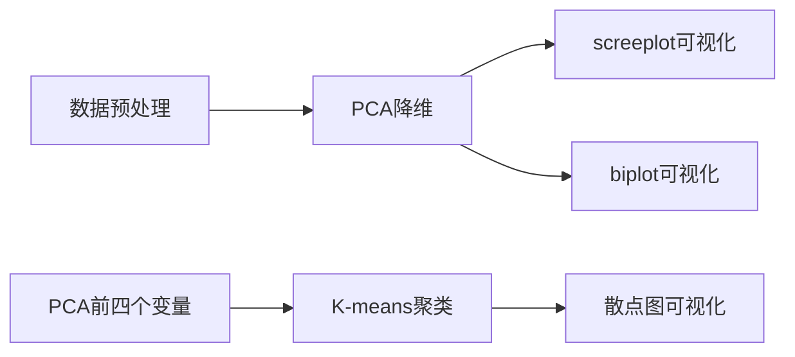

# 任务拆解

## 数据预处理

1. 数据存在较多NaN值

使用该列的均值替换Nan值

2. 同时发现变量的数值范围不在一个尺度范围

于是首先查看数值范围分布情况，发现近似于正态分布，于是对所有特征值采用Z-score归一化数值。

保存数据为`processed_data.csv`文件

## PCA降维

使用PCA降维方法,保存三个文件

loading.csv:记录了载荷矩阵（loadings matrix）

> 载荷矩阵是原始数据集的特征与主成分之间的关系矩阵。具体来说，载荷矩阵的每一列代表一个主成分，每一行代表原始数据集中的一个特征。

pca_data.csv:pca降维后的数据集，每一行代表一个样本，每一列代表一个主成分。

pca_explained_variance_ratio.csv：这个文件记录了每个主成分解释的方差比例。方差比例表示了每个主成分在总方差中所占的比例，即每个主成分的重要性

# 什么是PCA降维？

将现有维度，降低为更少的维度（也称为主成分），其中每个主成分有1-N个维度线性组织而成。

###  输入数据 *X*

- **输入数据 \*X\***：通常是一个二维数组，形状为 (*n*samples,*n*features)，即有 *n*samples 个样本，每个样本有 *n*features 个特征。

### . 参数

- **`n_components`**：这是 PCA 的一个关键参数，表示你希望降维到的目标维度数。它是一个整数，通常小于原始数据的特征数 *n*features。
  - **影响**：设置 `n_components` 的值会影响 `X_transform` 的返回值的形状。具体来说，`X_transform` 的形状将是 (*n*samples,*n*components)。

###  属性

- **`components_`**：这是一个二维数组，形状为 (*n*components,*n*features)。每一行代表一个主成分，每一列对应原始数据的一个特征。它表示主成分在原始特征空间中的方向。

**`explained_variance_`**：这是一个一维数组，长度为 *n*components。它表示每个主成分的方差，即每个主成分解释的数据方差量。

**`explained_variance_ratio_`**：这也是一个一维数组，长度为 *n*components。它表示每个主成分解释的方差占总方差的比例。

所以，在数据预处理之后，先了解PCA的功能是什么，然后PCA的形参、属性、方法。

