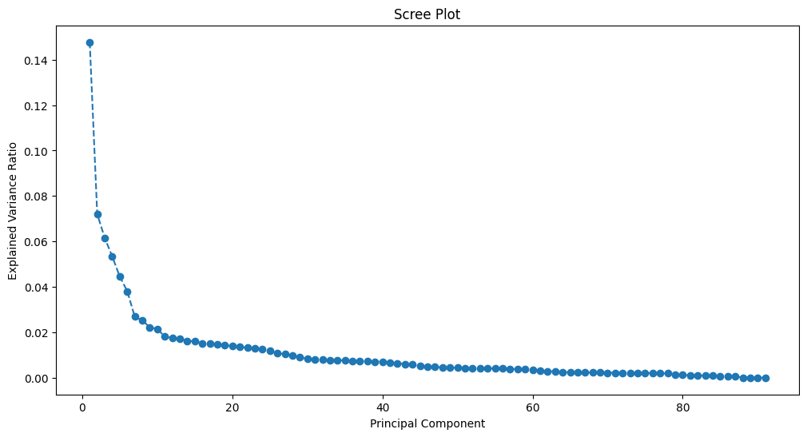

```python
#读取数据，查看数据情况
!pip install pandas
import pandas as pd
```

    
    [notice] A new release of pip is available: 24.0 -> 25.0.1
    [notice] To update, run: python.exe -m pip install --upgrade pip
    

    Collecting pandas
      Using cached pandas-2.2.3-cp312-cp312-win_amd64.whl.metadata (19 kB)
    Requirement already satisfied: numpy>=1.26.0 in c:\users\22779\appdata\local\programs\python\python312\lib\site-packages (from pandas) (1.26.4)
    Requirement already satisfied: python-dateutil>=2.8.2 in c:\users\22779\appdata\local\programs\python\python312\lib\site-packages (from pandas) (2.9.0.post0)
    Collecting pytz>=2020.1 (from pandas)
      Using cached pytz-2025.1-py2.py3-none-any.whl.metadata (22 kB)
    Collecting tzdata>=2022.7 (from pandas)
      Using cached tzdata-2025.1-py2.py3-none-any.whl.metadata (1.4 kB)
    Requirement already satisfied: six>=1.5 in c:\users\22779\appdata\local\programs\python\python312\lib\site-packages (from python-dateutil>=2.8.2->pandas) (1.16.0)
    Using cached pandas-2.2.3-cp312-cp312-win_amd64.whl (11.5 MB)
    Using cached pytz-2025.1-py2.py3-none-any.whl (507 kB)
    Using cached tzdata-2025.1-py2.py3-none-any.whl (346 kB)
    Installing collected packages: pytz, tzdata, pandas
    Successfully installed pandas-2.2.3 pytz-2025.1 tzdata-2025.1
    


```python
data_path ="..\data\merged_cog_sswrer.csv"
data = pd.read_csv(data_path)
print(data.head())
print(data.info())
```

        HHID  PN  R1IMRC20  R2HIMRC20  R3IMRC  R4IMRC  R5IMRC  R6IMRC  R7IMRC  \
    0      1  10      11.0        NaN     NaN     NaN     NaN     NaN     NaN   
    1      2  10      11.0        7.0     5.0     5.0     5.0     NaN     NaN   
    2      3  10       5.0        3.0    10.0    10.0    10.0     9.0     4.0   
    3      3  20      11.0       11.0     6.0     6.0     6.0     6.0     6.0   
    4  10001  10       5.0        8.0     7.0     8.0     7.0     5.0     7.0   
    
       R8IMRC  ...  R11SSWRER  H11SSWRER  R12SSWRER  H12SSWRER  R13SSWRER  \
    0     NaN  ...        NaN        NaN        NaN        NaN        NaN   
    1     NaN  ...        NaN        NaN        NaN        NaN        NaN   
    2     3.0  ...        NaN        NaN        NaN        NaN        NaN   
    3     5.0  ...        NaN        NaN        NaN        NaN        NaN   
    4     7.0  ...        NaN        NaN        NaN        NaN        NaN   
    
       H13SSWRER  R14SSWRER  H14SSWRER  R15SSWRER  H15SSWRER  
    0        NaN        NaN        NaN        NaN        NaN  
    1        NaN        NaN        NaN        NaN        NaN  
    2        NaN        NaN        NaN        NaN        NaN  
    3        NaN        NaN        NaN        NaN        NaN  
    4        NaN        NaN        NaN        NaN        NaN  
    
    [5 rows x 101 columns]
    <class 'pandas.core.frame.DataFrame'>
    RangeIndex: 30914 entries, 0 to 30913
    Columns: 101 entries, HHID to H15SSWRER
    dtypes: float64(99), int64(2)
    memory usage: 23.8 MB
    None
    

    <>:1: SyntaxWarning: invalid escape sequence '\d'
    <>:1: SyntaxWarning: invalid escape sequence '\d'
    C:\Users\22779\AppData\Local\Temp\ipykernel_45108\1222189032.py:1: SyntaxWarning: invalid escape sequence '\d'
      data_path ="..\data\merged_cog_sswrer.csv"
    


```python
# 填补每一列的缺失值
data.iloc[:, 1:] = data.iloc[:, 1:].apply(lambda x: x.fillna(x.mean()), axis=0)
# 打印结果
print(data.describe())
```

                    HHID            PN      R1IMRC20     R2HIMRC20        R3IMRC  \
    count   30914.000000  30914.000000  30914.000000  30914.000000  30914.000000   
    mean   320132.204470     15.572200      7.440040      7.909924      6.021907   
    std    286655.653752      8.091804      1.693627      1.867062      0.974277   
    min         1.000000     10.000000      0.000000      0.000000      0.000000   
    25%     51056.750000     10.000000      7.440040      7.909924      6.021907   
    50%    173689.500000     10.000000      7.440040      7.909924      6.021907   
    75%    535162.750000     20.000000      7.440040      7.909924      6.021907   
    max    959738.000000     43.000000     20.000000     20.000000     10.000000   
    
                 R4IMRC        R5IMRC        R6IMRC        R7IMRC        R8IMRC  \
    count  30914.000000  30914.000000  30914.000000  30914.000000  30914.000000   
    mean       6.131755      5.874208      5.815895      5.706746      5.662717   
    std        1.050103      1.020877      0.999856      1.051339      1.085207   
    min        0.000000      0.000000      0.000000      0.000000      0.000000   
    25%        6.131755      5.874208      5.815895      5.706746      5.662717   
    50%        6.131755      5.874208      5.815895      5.706746      5.662717   
    75%        6.131755      5.874208      5.815895      6.000000      5.662717   
    max       10.000000     10.000000     10.000000     10.000000     10.000000   
    
           ...      R11SSWRER      H11SSWRER      R12SSWRER      H12SSWRER  \
    count  ...   30914.000000   30914.000000   30914.000000   30914.000000   
    mean   ...  125125.686101  205493.264308  135902.897648  215127.662179   
    std    ...   37861.715500   67166.628863   36923.597829   65694.530075   
    min    ...       0.000000       0.000000       0.000000       0.000000   
    25%    ...  125125.686101  205493.264308  135902.897648  215127.662179   
    50%    ...  125125.686101  205493.264308  135902.897648  215127.662179   
    75%    ...  125125.686101  205493.264308  135902.897648  215127.662179   
    max    ...  285500.000000  584700.000000  307500.000000  620400.000000   
    
               R13SSWRER      H13SSWRER      R14SSWRER      H14SSWRER  \
    count   30914.000000   30914.000000   30914.000000   30914.000000   
    mean   137263.523351  218167.882174  151173.491546  233706.509368   
    std     44532.064826   78549.947192   40999.924209   72030.472455   
    min         0.000000       0.000000       0.000000       0.000000   
    25%    137263.523351  218167.882174  151173.491546  233706.509368   
    50%    137263.523351  218167.882174  151173.491546  233706.509368   
    75%    137263.523351  218167.882174  151173.491546  233706.509368   
    max    321200.000000  663900.000000  346700.000000  691000.000000   
    
               R15SSWRER      H15SSWRER  
    count   30914.000000   30914.000000  
    mean   176343.144351  261761.257183  
    std     42149.773887   73952.459523  
    min         0.000000       0.000000  
    25%    176343.144351  261761.257183  
    50%    176343.144351  261761.257183  
    75%    176343.144351  261761.257183  
    max    399900.000000  809900.000000  
    
    [8 rows x 101 columns]
    


```python
#数据可视化查看，数据分布情况，决定用哪种归一化方法
!pip install seaborn
!pip install matplotlib
import seaborn as sns

import matplotlib.pyplot as plt

# Plot histogram for R1IMRC20
plt.figure(figsize=(12, 6))
sns.histplot(data['R1IMRC20'], kde=True)
plt.title('Distribution of R1IMRC20')
plt.xlabel('R1IMRC20')
plt.ylabel('Frequency')
plt.show()

# Plot histogram for R12SSWRER
plt.figure(figsize=(12, 6))
sns.histplot(data['R12SSWRER'], kde=True)
plt.title('Distribution of R12SSWRER')
plt.xlabel('R12SSWRER')
plt.ylabel('Frequency')
plt.show()


```

    Collecting seaborn
      Downloading seaborn-0.13.2-py3-none-any.whl.metadata (5.4 kB)
    Requirement already satisfied: numpy!=1.24.0,>=1.20 in c:\users\22779\appdata\local\programs\python\python312\lib\site-packages (from seaborn) (1.26.4)
    Requirement already satisfied: pandas>=1.2 in c:\users\22779\appdata\local\programs\python\python312\lib\site-packages (from seaborn) (2.2.3)
    Requirement already satisfied: matplotlib!=3.6.1,>=3.4 in c:\users\22779\appdata\local\programs\python\python312\lib\site-packages (from seaborn) (3.8.3)
    Requirement already satisfied: contourpy>=1.0.1 in c:\users\22779\appdata\local\programs\python\python312\lib\site-packages (from matplotlib!=3.6.1,>=3.4->seaborn) (1.2.0)
    Requirement already satisfied: cycler>=0.10 in c:\users\22779\appdata\local\programs\python\python312\lib\site-packages (from matplotlib!=3.6.1,>=3.4->seaborn) (0.12.1)
    Requirement already satisfied: fonttools>=4.22.0 in c:\users\22779\appdata\local\programs\python\python312\lib\site-packages (from matplotlib!=3.6.1,>=3.4->seaborn) (4.50.0)
    Requirement already satisfied: kiwisolver>=1.3.1 in c:\users\22779\appdata\local\programs\python\python312\lib\site-packages (from matplotlib!=3.6.1,>=3.4->seaborn) (1.4.5)
    Requirement already satisfied: packaging>=20.0 in c:\users\22779\appdata\local\programs\python\python312\lib\site-packages (from matplotlib!=3.6.1,>=3.4->seaborn) (24.0)
    Requirement already satisfied: pillow>=8 in c:\users\22779\appdata\local\programs\python\python312\lib\site-packages (from matplotlib!=3.6.1,>=3.4->seaborn) (10.2.0)
    Requirement already satisfied: pyparsing>=2.3.1 in c:\users\22779\appdata\local\programs\python\python312\lib\site-packages (from matplotlib!=3.6.1,>=3.4->seaborn) (3.1.2)
    Requirement already satisfied: python-dateutil>=2.7 in c:\users\22779\appdata\local\programs\python\python312\lib\site-packages (from matplotlib!=3.6.1,>=3.4->seaborn) (2.9.0.post0)
    Requirement already satisfied: pytz>=2020.1 in c:\users\22779\appdata\local\programs\python\python312\lib\site-packages (from pandas>=1.2->seaborn) (2025.1)
    Requirement already satisfied: tzdata>=2022.7 in c:\users\22779\appdata\local\programs\python\python312\lib\site-packages (from pandas>=1.2->seaborn) (2025.1)
    Requirement already satisfied: six>=1.5 in c:\users\22779\appdata\local\programs\python\python312\lib\site-packages (from python-dateutil>=2.7->matplotlib!=3.6.1,>=3.4->seaborn) (1.16.0)
    Downloading seaborn-0.13.2-py3-none-any.whl (294 kB)
       ---------------------------------------- 0.0/294.9 kB ? eta -:--:--
       - -------------------------------------- 10.2/294.9 kB ? eta -:--:--
       ---- ---------------------------------- 30.7/294.9 kB 435.7 kB/s eta 0:00:01
       ------------ -------------------------- 92.2/294.9 kB 744.7 kB/s eta 0:00:01
       ------------------- ------------------ 153.6/294.9 kB 913.1 kB/s eta 0:00:01
       ---------------------------------------- 294.9/294.9 kB 1.5 MB/s eta 0:00:00
    Installing collected packages: seaborn
    Successfully installed seaborn-0.13.2
    

    WARNING: Retrying (Retry(total=4, connect=None, read=None, redirect=None, status=None)) after connection broken by 'ProxyError('Cannot connect to proxy.', TimeoutError('_ssl.c:983: The handshake operation timed out'))': /simple/seaborn/
      WARNING: Retrying (Retry(total=4, connect=None, read=None, redirect=None, status=None)) after connection broken by 'ProxyError('Cannot connect to proxy.', TimeoutError('_ssl.c:983: The handshake operation timed out'))': /packages/83/11/00d3c3dfc25ad54e731d91449895a79e4bf2384dc3ac01809010ba88f6d5/seaborn-0.13.2-py3-none-any.whl.metadata
    
    [notice] A new release of pip is available: 24.0 -> 25.0.1
    [notice] To update, run: python.exe -m pip install --upgrade pip
    

    Requirement already satisfied: matplotlib in c:\users\22779\appdata\local\programs\python\python312\lib\site-packages (3.8.3)
    Requirement already satisfied: contourpy>=1.0.1 in c:\users\22779\appdata\local\programs\python\python312\lib\site-packages (from matplotlib) (1.2.0)
    Requirement already satisfied: cycler>=0.10 in c:\users\22779\appdata\local\programs\python\python312\lib\site-packages (from matplotlib) (0.12.1)
    Requirement already satisfied: fonttools>=4.22.0 in c:\users\22779\appdata\local\programs\python\python312\lib\site-packages (from matplotlib) (4.50.0)
    Requirement already satisfied: kiwisolver>=1.3.1 in c:\users\22779\appdata\local\programs\python\python312\lib\site-packages (from matplotlib) (1.4.5)
    Requirement already satisfied: numpy<2,>=1.21 in c:\users\22779\appdata\local\programs\python\python312\lib\site-packages (from matplotlib) (1.26.4)
    Requirement already satisfied: packaging>=20.0 in c:\users\22779\appdata\local\programs\python\python312\lib\site-packages (from matplotlib) (24.0)
    Requirement already satisfied: pillow>=8 in c:\users\22779\appdata\local\programs\python\python312\lib\site-packages (from matplotlib) (10.2.0)
    Requirement already satisfied: pyparsing>=2.3.1 in c:\users\22779\appdata\local\programs\python\python312\lib\site-packages (from matplotlib) (3.1.2)
    Requirement already satisfied: python-dateutil>=2.7 in c:\users\22779\appdata\local\programs\python\python312\lib\site-packages (from matplotlib) (2.9.0.post0)
    Requirement already satisfied: six>=1.5 in c:\users\22779\appdata\local\programs\python\python312\lib\site-packages (from python-dateutil>=2.7->matplotlib) (1.16.0)
    

    
    [notice] A new release of pip is available: 24.0 -> 25.0.1
    [notice] To update, run: python.exe -m pip install --upgrade pip
    


    

    


    

    


```python
#使用Z-score归一化数据，然后保存为processed_data.csv
!pip install scikit-learn
from sklearn.preprocessing import StandardScaler

scaler = StandardScaler()
scaled_features = scaler.fit_transform(data.iloc[:, 1:])
scaled_df = pd.DataFrame(scaled_features, columns=data.columns[1:])
scaled_df.insert(0, 'HHID', data['HHID'])

scaled_df.to_csv('..\data\processed_data.csv', index=False)
print("Data has been normalized and saved to processed_data.csv.")

```

    <>:10: SyntaxWarning: invalid escape sequence '\d'
    <>:10: SyntaxWarning: invalid escape sequence '\d'
    C:\Users\22779\AppData\Local\Temp\ipykernel_45108\166829735.py:10: SyntaxWarning: invalid escape sequence '\d'
      scaled_df.to_csv('..\data\processed_data.csv', index=False)
    

    Collecting scikit-learn
      Downloading scikit_learn-1.6.1-cp312-cp312-win_amd64.whl.metadata (15 kB)
    Requirement already satisfied: numpy>=1.19.5 in c:\users\22779\appdata\local\programs\python\python312\lib\site-packages (from scikit-learn) (1.26.4)
    Requirement already satisfied: scipy>=1.6.0 in c:\users\22779\appdata\local\programs\python\python312\lib\site-packages (from scikit-learn) (1.12.0)
    Requirement already satisfied: joblib>=1.2.0 in c:\users\22779\appdata\local\programs\python\python312\lib\site-packages (from scikit-learn) (1.3.2)
    Collecting threadpoolctl>=3.1.0 (from scikit-learn)
      Using cached threadpoolctl-3.5.0-py3-none-any.whl.metadata (13 kB)
    Downloading scikit_learn-1.6.1-cp312-cp312-win_amd64.whl (11.1 MB)
       ---------------------------------------- 0.0/11.1 MB ? eta -:--:--
       ---------------------------------------- 0.1/11.1 MB 2.0 MB/s eta 0:00:06
       - -------------------------------------- 0.4/11.1 MB 4.9 MB/s eta 0:00:03
       --- ------------------------------------ 0.9/11.1 MB 7.2 MB/s eta 0:00:02
       --- ------------------------------------ 1.1/11.1 MB 7.8 MB/s eta 0:00:02
       --- ------------------------------------ 1.1/11.1 MB 7.8 MB/s eta 0:00:02
       -------- ------------------------------- 2.2/11.1 MB 8.4 MB/s eta 0:00:02
       --------- ------------------------------ 2.6/11.1 MB 8.8 MB/s eta 0:00:01
       --------- ------------------------------ 2.7/11.1 MB 7.5 MB/s eta 0:00:02
       --------- ------------------------------ 2.7/11.1 MB 7.5 MB/s eta 0:00:02
       --------- ------------------------------ 2.7/11.1 MB 7.5 MB/s eta 0:00:02
       ----------------- ---------------------- 4.9/11.1 MB 9.9 MB/s eta 0:00:01
       ------------------- -------------------- 5.4/11.1 MB 10.1 MB/s eta 0:00:01
       ------------------- -------------------- 5.4/11.1 MB 10.1 MB/s eta 0:00:01
       --------------------- ------------------ 5.9/11.1 MB 9.4 MB/s eta 0:00:01
       --------------------- ------------------ 6.1/11.1 MB 9.0 MB/s eta 0:00:01
       ----------------------- ---------------- 6.6/11.1 MB 9.6 MB/s eta 0:00:01
       ----------------------------- ---------- 8.1/11.1 MB 10.5 MB/s eta 0:00:01
       ------------------------------ --------- 8.6/11.1 MB 10.6 MB/s eta 0:00:01
       -------------------------------- ------- 9.2/11.1 MB 10.6 MB/s eta 0:00:01
       --------------------------------- ------ 9.4/11.1 MB 10.6 MB/s eta 0:00:01
       --------------------------------- ------ 9.4/11.1 MB 10.6 MB/s eta 0:00:01
       ---------------------------------- ----- 9.6/11.1 MB 9.7 MB/s eta 0:00:01
       ----------------------------------- ---- 9.9/11.1 MB 9.4 MB/s eta 0:00:01
       ------------------------------------- -- 10.4/11.1 MB 9.9 MB/s eta 0:00:01
       ---------------------------------------  11.0/11.1 MB 9.9 MB/s eta 0:00:01
       ---------------------------------------- 11.1/11.1 MB 9.8 MB/s eta 0:00:00
    Using cached threadpoolctl-3.5.0-py3-none-any.whl (18 kB)
    Installing collected packages: threadpoolctl, scikit-learn
    Successfully installed scikit-learn-1.6.1 threadpoolctl-3.5.0
    

      WARNING: Retrying (Retry(total=4, connect=None, read=None, redirect=None, status=None)) after connection broken by 'ProxyError('Cannot connect to proxy.', TimeoutError('_ssl.c:983: The handshake operation timed out'))': /packages/62/27/585859e72e117fe861c2079bcba35591a84f801e21bc1ab85bce6ce60305/scikit_learn-1.6.1-cp312-cp312-win_amd64.whl.metadata
    
    [notice] A new release of pip is available: 24.0 -> 25.0.1
    [notice] To update, run: python.exe -m pip install --upgrade pip
    

    Data has been normalized and saved to processed_data.csv.
    


```python

from sklearn.decomposition import PCA

# 使用PCA降维处理
pca = PCA(n_components='mle')
pca.fit(scaled_df.iloc[:, 1:])

# 绘制scree plot查看特征值的排序
plt.figure(figsize=(12, 6))
plt.plot(range(1, len(pca.explained_variance_ratio_) + 1), pca.explained_variance_ratio_, marker='o', linestyle='--')
plt.title('Scree Plot')
plt.xlabel('Principal Component')#主成分
plt.ylabel('Explained Variance Ratio')#解释方差/总方差的比例，越大则该成分越重要
plt.show()


```


    

    


```python
eigenvalues_length =len(pca.explained_variance_)

# 打印特征值
print("PCA后的特征数量", eigenvalues_length)
```

    PCA后的特征数量 91
    


```python
!pip install numpy
```


```python

import numpy as np
import matplotlib.pyplot as plt
from sklearn.decomposition import PCA


pca = PCA(n_components=2)  # 为了可视化，通常选择前两个主成分
pca.fit(scaled_df.iloc[:, 1:])

# 获取主成分的投影
X_pca = pca.transform(scaled_df.iloc[:, 1:])

# 获取特征向量（主成分的方向）
components = pca.components_.T  # 转置以便于绘图

# 获取特征值（方差）
explained_variance = pca.explained_variance_

# 创建biplot
plt.figure(figsize=(10, 8))

# 绘制样本点
plt.scatter(X_pca[:, 0], X_pca[:, 1], alpha=0.1, label='Samples')

# 绘制特征向量（箭头）
for i, (x, y) in enumerate(components):
    plt.arrow(0, 0, x, y, color='r', alpha=1, label=f'Feature {i+1}' if i < 4 else "", 
              head_width=0.2, head_length=0.2)

# 添加特征名称
for i, (x, y) in enumerate(components):
    plt.text(x + 0.02, y + 0.02, f'Feature {i+1}', fontsize=10, ha='center', va='center')

# 设置图形标题和标签
plt.title('Biplot of PCA')
plt.xlabel(f'PC1 ({explained_variance[0]:.2%} variance)')
plt.ylabel(f'PC2 ({explained_variance[1]:.2%} variance)')
plt.legend()
plt.grid()
plt.show()
```

    Requirement already satisfied: numpy in c:\users\22779\appdata\local\programs\python\python312\lib\site-packages (1.26.4)
    

    
    [notice] A new release of pip is available: 24.0 -> 25.0.1
    [notice] To update, run: python.exe -m pip install --upgrade pip
    


    

    


```python
https://towardsdatascience.com/pca-clearly-explained-how-when-why-to-use-it-and-feature-importance-a-guide-in-python-7c274582c37e/

```
