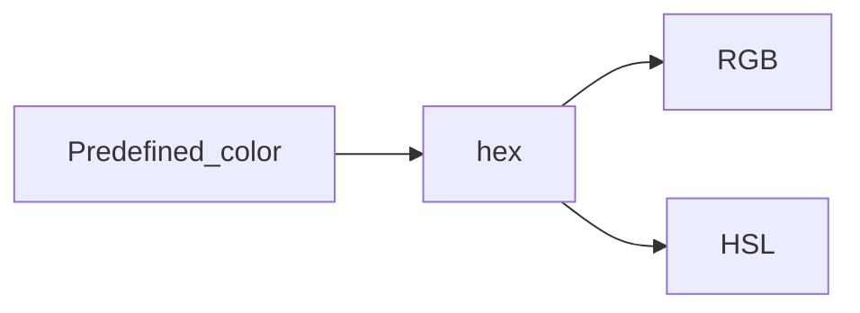

# 颜色

在网页设计和图形编程中，颜色的表示和使用是一个基础而重要的概念。MDN 提供了预定义的颜色名称，这些颜色可以直接通过名称使用，如 `"red"`、`"blue"` 等。然而，这些预定义的颜色数量有限，且不够灵活。因此，开发者通常会使用更精确的颜色表示方法，如 HEX、RGB 和 HSL。

HEX 颜色使用六位十六进制数表示颜色，格式为 `#xxxxxx`。虽然 HEX 颜色直观且易于使用，但它有一个明显的缺点：无法直接设置透明度。相比之下，RGB 颜色由红、绿、蓝三个参数组成，数值越大颜色越深。RGB 颜色的一个显著优势是可以通过添加 alpha 参数来设置透明度，从而实现颜色的混合和渐变效果。HSL 颜色则提供了一种更直观的方式来定义颜色，它由色调（hue）、饱和度（saturation）和亮度（lightness）三个参数组成。色调是一个介于 0 到 360 度之间的值，表示颜色在色轮上的位置；饱和度和亮度的取值范围均为 0% 到 100%，分别表示颜色的鲜艳程度和明暗程度。HSL 颜色同样可以通过 alpha 参数来设置透明度。

在实际应用中，选择使用 HEX、RGB 还是 HSL 颜色取决于具体需求。如果需要对颜色进行微调，RGB 是更好的选择，因为它允许直接修改颜色的红、绿、蓝三个分量。而 HSL 则更适合于需要定制颜色的场景，因为它提供了更直观的颜色调整方式。无论是 RGB 还是 HSL 颜色，都可以通过添加 alpha 参数来设置颜色的透明度，从而实现更丰富的视觉效果。

# 颜色渐变:动态

在动态图形和动画设计中，颜色渐变是一个常见的需求。以 d3.js 为例，可以通过定义 `defs` 元素来创建可复用的图形元素，如渐变。`defs` 是一个容器元素，用于存储 patterns、gradients 等图形元素。`linearGradient` 是定义线性渐变的元素，它通过 `x1`、`x2`、`y1` 和 `y2` 属性来定义渐变的方向。这些属性可以使用准确的坐标值，也可以使用百分比来表示相对于视口或边界框的宽度和高度。`stop` 元素用于定义渐变中的颜色和位置，它通过 `offset` 属性指定颜色在渐变中的位置，通过 `stop-color` 属性指定颜色，还可以通过 `stop-opacity` 属性指定颜色的透明度。

定义了线性渐变规则后，需要使用 `animate` 元素来实现渐变的动态变化。`animate` 元素可以对指定元素的属性进行动态变化，从而实现动画效果。

> element:  a specific tag or component used to define shapes,text,images

# 参考

[color in css](https://blog.logrocket.com/advanced-guide-setting-colors-css/)

[color gradient animation in d3.js](https://gist.github.com/nbremer/6f5b472cabe8f85583989a40eef0303c)

[animate a gradient to imitate a flow in d3.js](https://www.visualcinnamon.com/2016/05/animate-gradient-imitate-flow-d3/)